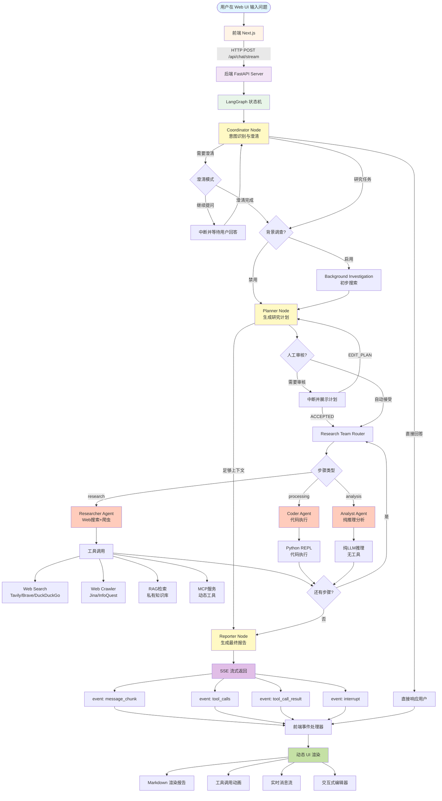
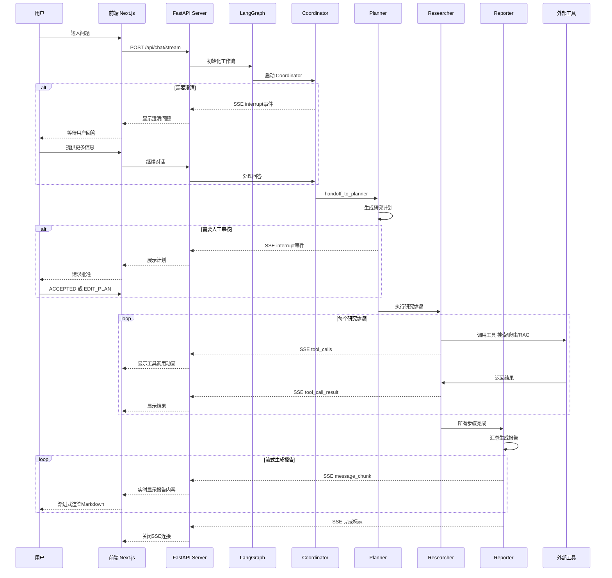
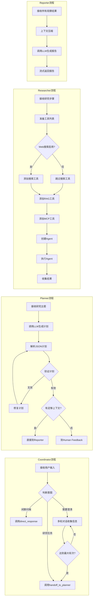
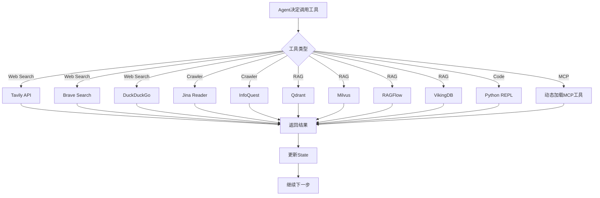
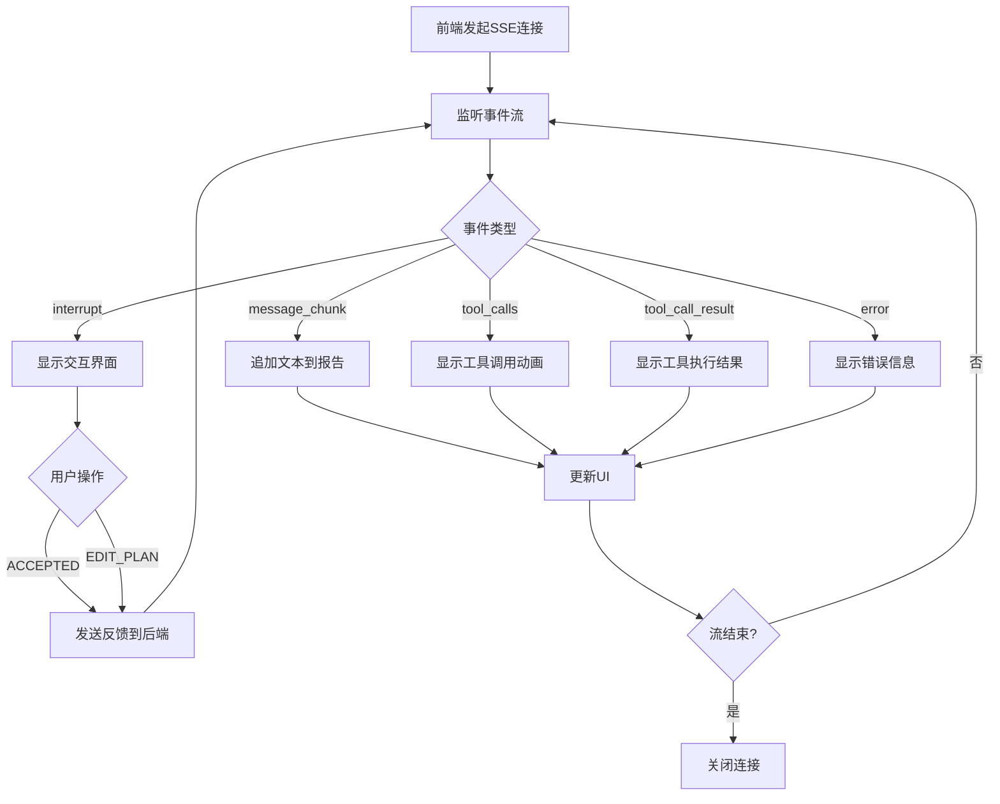
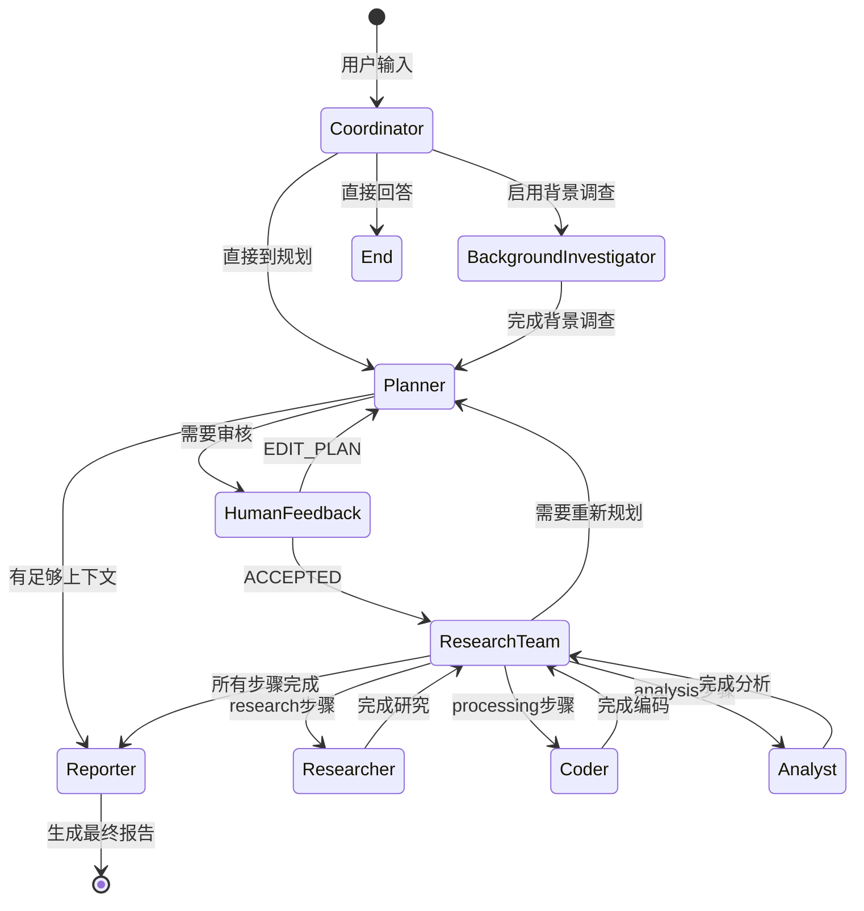

# DeerFlow Agent 架构流程图

## 一、整体架构流程图



## 二、数据流向时序图



## 三、Agent节点详细流程图



## 四、工具调用流程图



## 五、前端SSE事件处理流程



## 六、状态转换图



## 七、核心文件路径结构

```
后端核心架构
├── src/server/app.py                    # FastAPI 主服务器
│   ├── /api/chat/stream                 # 核心SSE流接口
│   ├── /api/tts                         # 文本转语音
│   ├── /api/podcast/generate            # 播客生成
│   └── /api/ppt/generate                # PPT生成
│
├── src/graph/                           # LangGraph工作流
│   ├── builder.py                       # 状态图构建器
│   ├── nodes.py                         # 核心Agent节点实现
│   ├── types.py                         # 状态类型定义
│   └── utils.py                         # 工具函数
│
├── src/agents/agents.py                 # Agent创建工厂
├── src/tools/                           # 工具集
│   ├── search.py                        # 搜索工具
│   ├── crawler.py                       # 爬虫工具
│   └── python_repl.py                   # 代码执行
│
├── src/rag/                             # RAG集成
│   ├── retriever.py                     # 检索器
│   └── builder.py                       # RAG构建器
│
└── src/prompts/                         # Prompt模板
    └── *.md                             # 各Agent的提示词

前端核心架构
├── web/src/app/chat/
│   ├── page.tsx                         # 聊天页面入口
│   ├── main.tsx                         # 主组件
│   └── components/
│       ├── message-list-view.tsx        # 消息列表
│       ├── research-block.tsx           # 研究过程展示
│       └── input-box.tsx                # 输入框组件
│
├── web/src/core/
│   ├── api/chat.ts                      # 聊天API封装
│   ├── sse/
│   │   ├── StreamEvent.ts               # SSE事件类型
│   │   └── fetch-stream.ts              # SSE流处理
│   └── messages/
│       ├── types.ts                     # 消息类型定义
│       └── merge-message.ts             # 消息合并逻辑
│
└── web/src/components/
    ├── editor/                          # Notion风格编辑器
    └── deer-flow/markdown.tsx           # Markdown渲染器
```

